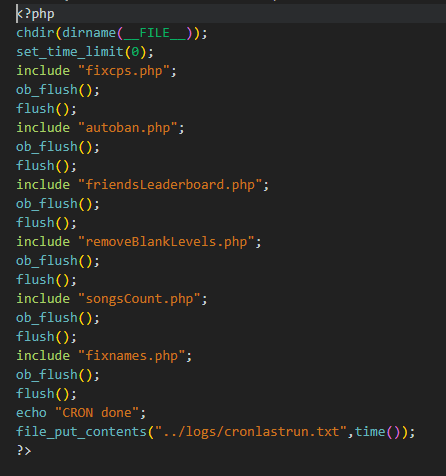
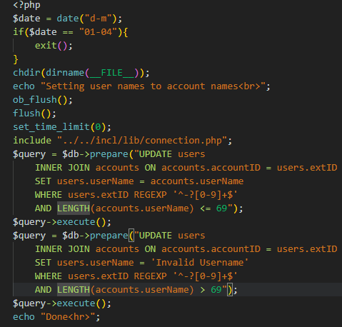
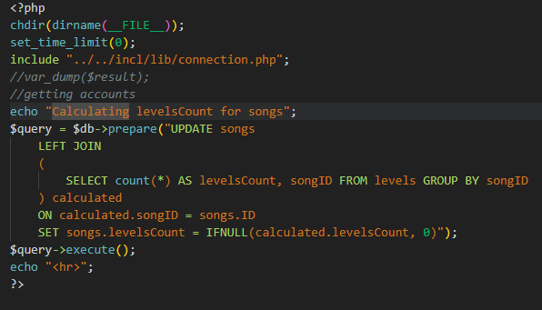
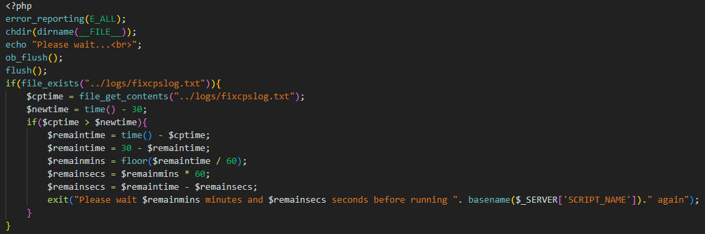
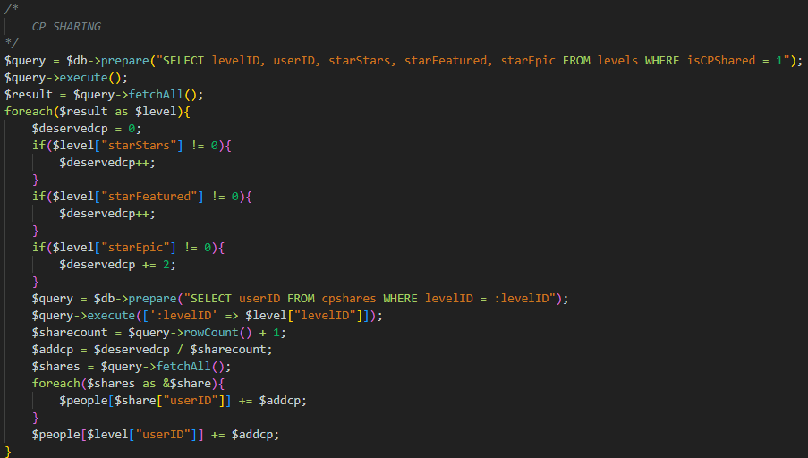
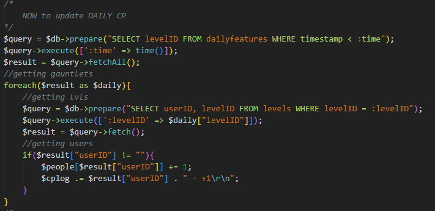
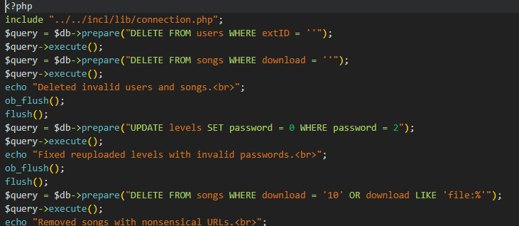
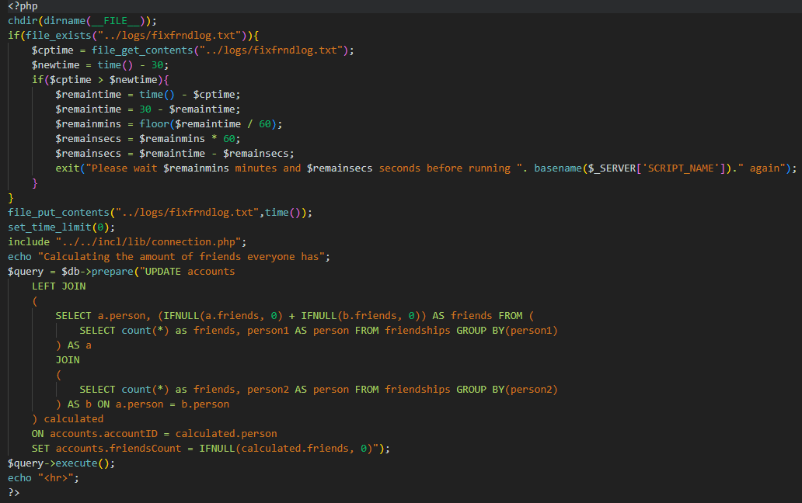

this is probably going to be the longest post i will make here.
# Cron.php

Cron.php is the main file that is in the folder. it runs every other php file in result running all of the php files in the folder simultaneously.


# autoban.php

Since i already coversed it in a different post, i will just link you there.
* [How Autoban works](../backend//how-autoban-php-works.md)

# fixnames.php

It really only fixes the username in the accounts section in the sql server to the usernames in the user section.


# SongCount.php

This file updates the amunt of levels use the song in the sql server. There isnt much else to say about this one.


# fixcps.php
this is one of the longer ones.

it first of all checks if there is a log file in the tools directory. if there is, it will check when it was created and see if was before the cooldown end. if it does the code will exit saying:
```php
	exit("Please wait $remainmins minutes and $remainsecs seconds before running ". basename($_SERVER['SCRIPT_NAME'])." again");
```


if the cooldown expired already, it include the connection.php file and start getting the users.


## CP SHARING

the code will now check the levels to see if the level has IsCPShared = 1
if its a yes, it will give both users a creator point each, also dependent if the level is star, featured or epiced.


## DAILY LEVEL CP

the code at this part is going to slelect the ID's from daily features and will give the creator of the level some creator points.


## DONE

the code finally finishes calculating everything and will give all of the users the specified creator point the code calculated.


were finally done with Fix CP.

# removeBlankLevels.php
simply removes invalid users, songs, fixes invalid passwords and removes songs with nonsensical URL's. Although no mention of deleting blank level as to the name.


# Friendsleaderboard.php
Simply updates the friends leaderboard for people.


# THE END
Well, thats the end of the guide. Now that i have explained everything the Cron.php file does, you will now know more than you probably wanted or needed to know about it.

## goodbye until my next guide.