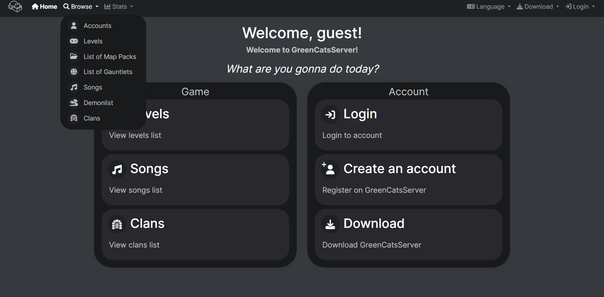

# New Dashboard

This tool is fantastic, it **improves the abandon dashboard to a much better**, useful and easy to use.

## This tool has several utilities including:

- All (T) and (N) tools has been integrated to Dashboard!
- All text has been translated!
- Trully night theme!
- Added new tools!
- Now you can fully use Dashboard!
- Now you can download GDPS direct from the site!
- Now you can change songs and delete your own songs!
- Now you can add an icon to navbar! It must be .png. Put icon to main dashboard directory
- Now you can send in-game messages through the Dashboard!
- New error pages! If your root folder isnt 'database', then change its name in .htaccess in /dashboard, or errors wont work
- More secure, than old dashboard!
- Your own demonlist with points! And API (example: for ObeyGDBot)
- Mail verification support!
- Favourite songs!
- [Your own GDPS Client!](https://github.com/MegaSa1nt/GDPS-Client)
- Captcha not only by hCaptcha! This Dashboard supports hCaptcha, reCaptcha and Cloudflare Turnstile!
- Proxy for reuploading levels!
- [GDPS Discord/Revolt Music Bot!](https://github.com/MegaSa1nt/GDPS-MusicBot)

**More information in this link:** [@GMDPrivateServer/Pull/833](https://github.com/Cvolton/GMDprivateServer/pull/883)

**This tool can be found at this link:** [github.com/MegaSa1nt/GMDprivateServer](https://github.com/MegaSa1nt/GMDprivateServer/tree/master)

