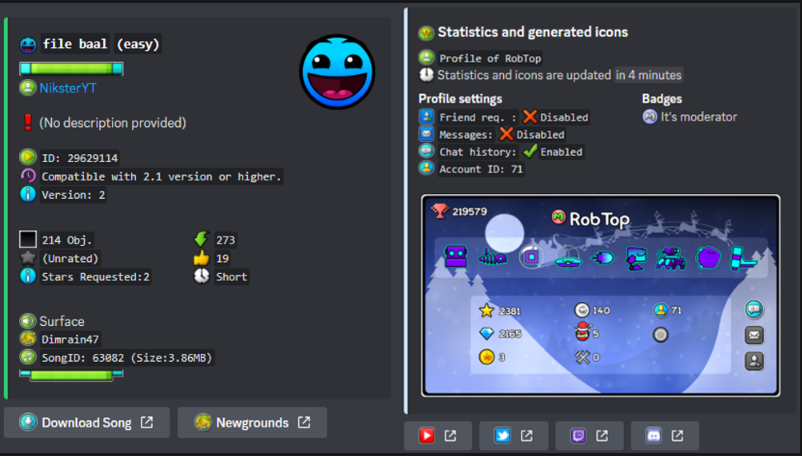

# ObeyGDBot (bot for GDPS)

It is a **useful Discord bot for your GDPS** with tools like adding songs, viewing your demon-list, viewing profiles and levels of your GDPS.

To link **your GDPS is easy**, you must go to the Discord server where you want to link your GDPS and invoke the command `/guild gdps link`

## This tool has several utilities including:

- Search profiles
- Profile customization
- Account linking
- Search levels
- Random search levels
- GDPS Tools: Search song, add songs or know who rated a level
- Rates Webhooks
- Extra badges mod support
- Custom rates support
- Custom Texture pack support
- Color palette support 
- Demon-list support
- Compatible with multiple languages
- And lots of future features!

**This tool can be found at this link:** [Discord.com AppDirectory ObeyGDBot](https://discord.com/application-directory/806057353920249866)

