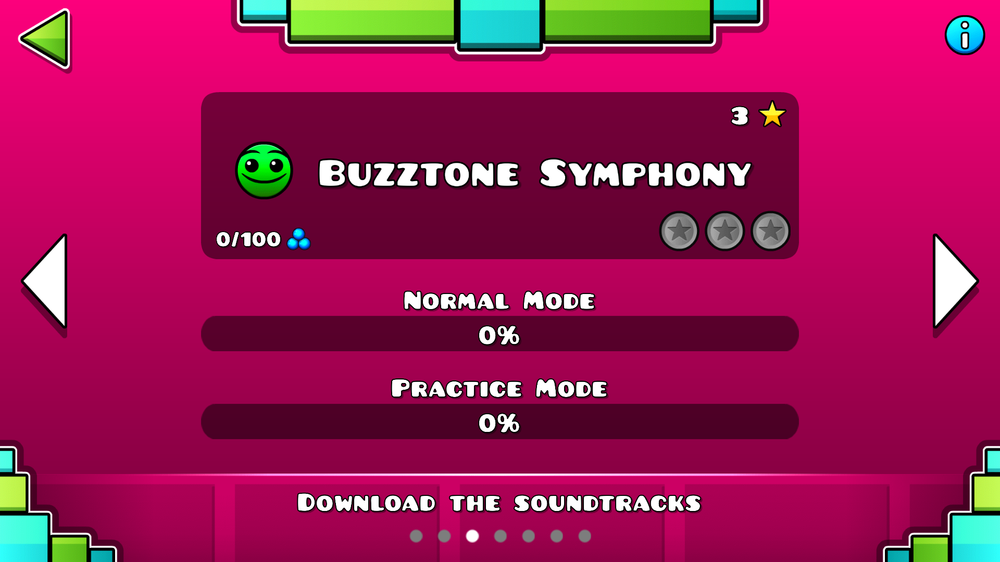
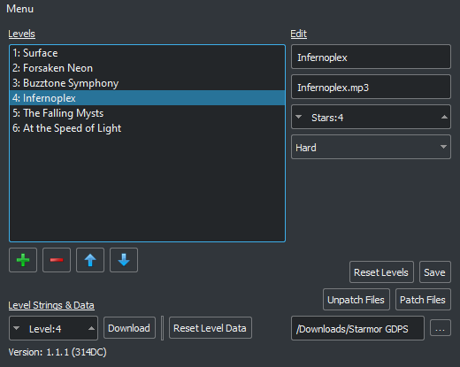
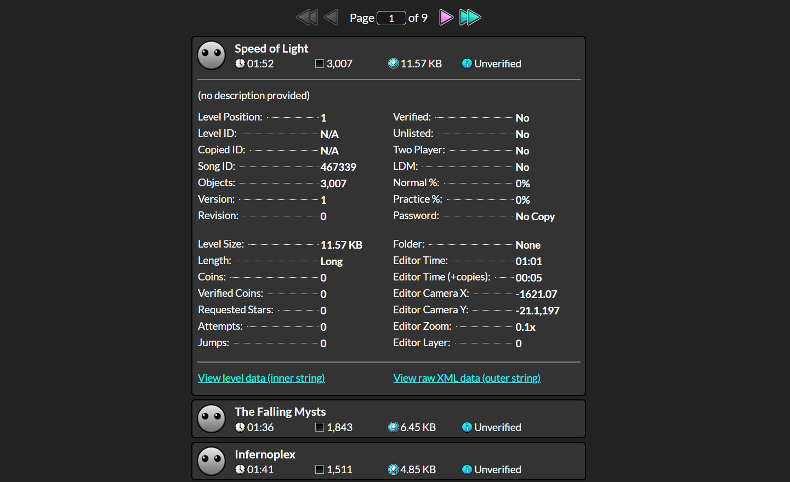
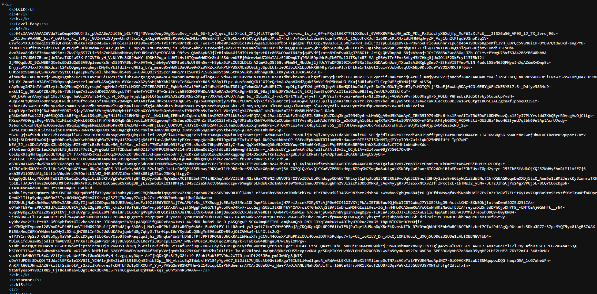
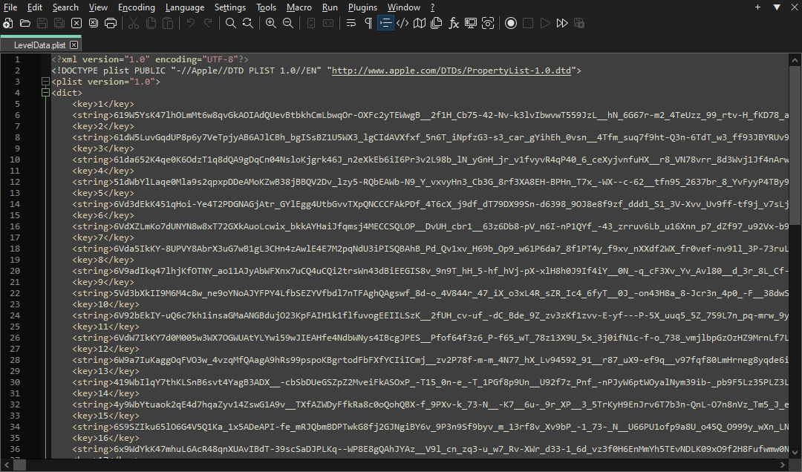

# How to add custom main levels (PC)

## Tools.
|Tool  |URL  |
|--|--|
|Level Manager  |https://www.youtube.com/watch?v=ZOTbHyuXx4I  |
|Save File Explorer  |https://gdcolon.com/gdsave/  |
|Notepad ++  |https://notepad-plus-plus.org/downloads/

## Level Manager.
Download and open the level manager, select your GD folder and add the main levels (along with name, song, difficulty and stars). Then, click "save" and "patch files". If you are using a custom song, add it into the resources folder.

*Note: RobTop blocked level downloads, so the Level Strings & Data section won't work. Therefore we will have to add the levels manually.*

## Save File Explorer.
Open the Save File Explorer. After, press Win + R (or search run in the windows search bar), type in "appdata" and press enter. Now go into local/GeometryDash and drag "CCLocalLevels.dat" to the Save File Explorer now search for the level you want to add, click on it and then click "View raw XML data".

Now you're going to see something like this (and probably be confused):

You just have to copy the large string of text.

## Notepad ++ and leveldata.plist.
Go to your GD resources folder and open "leveldata.plist" with Notepad ++, now replace the string of the level you want to replace with the one you previously copied, then remove "H4sIAAAAAAAAC" from it. At last, save the file.

Now repeat this for all the levels you want to add, then open GD to test if it worked.

*If you need any help, feel free to dm me (starmor) on Discord!*
