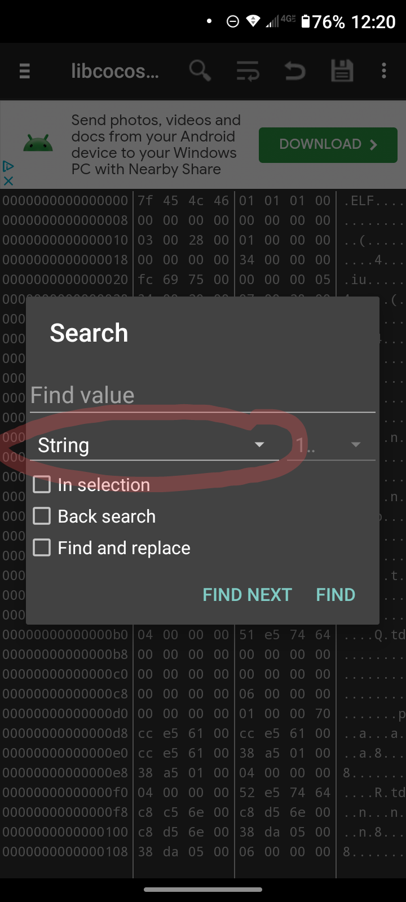
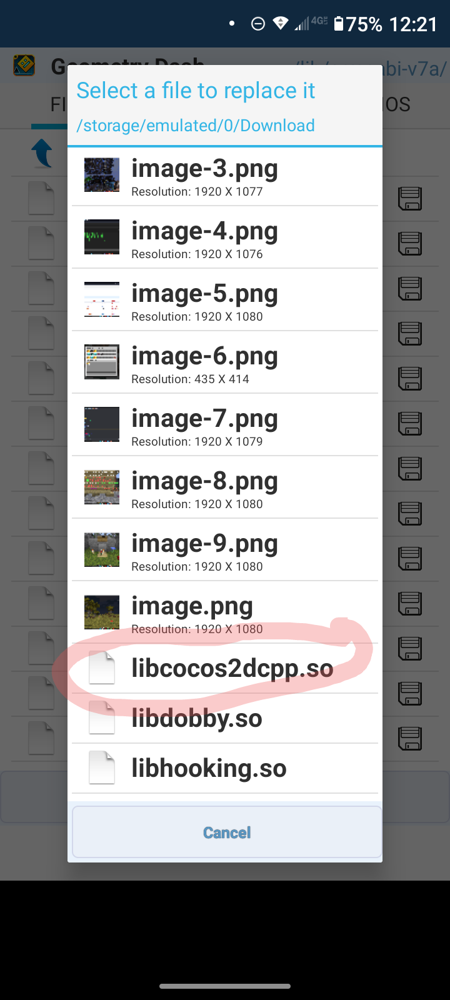

# Adding a Mod Menu to your GDPS
This guide will teach you how to add a Mod Menu to your GDPS on mobile and PC!

# Android 
To add a mod menu to your GDPS you must have the following. 
- A Hex Editor
- Italian Apk Downloader's Mod Menu [Find it Here](https://www.youtube.com/watchv=YNF_wk7uMuA)
- APK Editor
- Base64 Decoder [Website Link](https://www.base64encode.org/)
- Your GDPS's APK

1. Open APK Editor
2. Click "Select an APK File"
3. Find the APK of the **Mod Menu**
4. Click "Simple Edit"
5. Click on "Lib"

6. Click on "armebi-v7a"

8. Save "libcocos2dcpp.so"

Now you have 2 options for installing, either one works the same way.

### Method 1
The Hard Way (Kinda)

1. Open your Hex Editor

2. Find "libcocos2dcpp.so" and open it
3. Search for "www.boomlings.com/database" **Make sure your searching by a string and NOT a Hex Fragment**

4. Than tap "Find and Replace" and replace "www.boomlings.com/database" with your GDPS link (Findable on your GDPS panel
    For example, if your GDPS link is "epicgdps.ps.fhgdps.com" than you'll change "www.boomlings.com/database" to "epicgdps.ps.fhgdps.com"
5. Open the Base64 Decoder and type "http://www.boomlings.com/database" and press "encode"
6. Copy the result and search for it in your Hex Editor
7. Go back to the Base64 Decoder and type http:// **than** your GDPS link into the box and press "encode"
8. Copy the result and find and replace "aHR0cDovL3d3dy5ib29tbGluZ3MuY29tL2RhdGFiYXNl" with the GDPS's encoded link
9. Save the File
10. Open APK Editor
11. Click on the APK of the **Mod Menu**
12. Click "Simple Edit"
13. Click on "lib"
15. Click on "armebi-v7a"
15. Replace the "libcocos2dcpp.so" with the modified one you created

16. Click "Save"

### Method 2 

1. Go back to apk editor and close everything
2. Select your GDPS's APK File
3. Click Simple Edit
4. Go to "lib"
5. Go to "armebi-v7a"
6. Find "libcocos2dcpp.so"
7. Save it
8. Go back and select your Mod Menu APK
9. Go to the sane location again in the mod menu APK
10. Replace the old "libcocos2dcpp.so" with the one from your GDPS
11. Click "Save"

Your Done! Your GDPS should now have the mod menu when you open it. optioanlly you can do the following to fix the apk's name/package name

1. Open APK Editor
2. Find the Apk in the ApkEditor/tmp folder
3. Click "Common Edit"
4. Change the App icon/name or whatever you would like
5. Change the package name so you can have normal geometry dash and your GDPS at the same time
6. Click "Save"

Install the APK and the name should be the same!

# PC

## GDMegaOverlay
This part of the guide will teach you how to add GDMegaOverlay to your PC GDPS. You will need the following
- Your GDPS's Files
- GDMegaOverlay [https://github.com/maxnut/GDMegaOverlay]

1. Open your GDPS file (The files you got from the panel)
2. Download the "gdmo" folder from the GDMegaOverlay github
3. Copy all the files over to your GDPS's folder

Congradulations! You've installed a mod menu on your PC version of your GDPS!

## Mega Hack v5 
This part will teach you how to install Mega Hack v5 onto your GDPS. You will need
- Your GDPS Files
- Mega Hack v5 (Free on Absolutes Website)

1. Open your GDPS Files
2. Make sure when you open your GDPS the window is called "Geometry Dash"
   If not, rename the exe and change it (Not explaining how because idk how)
3. Launch Mega Hack v5
4. It should auto-detect your GDPS and than your good to go!
