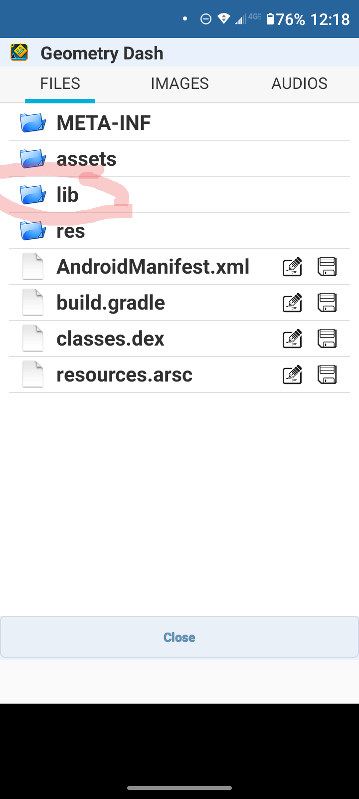
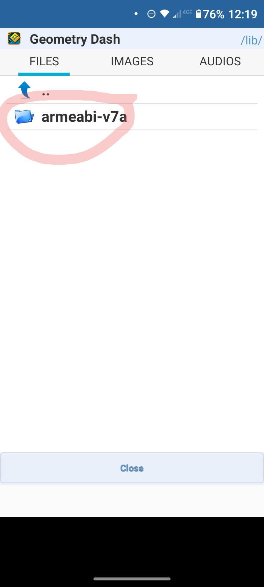
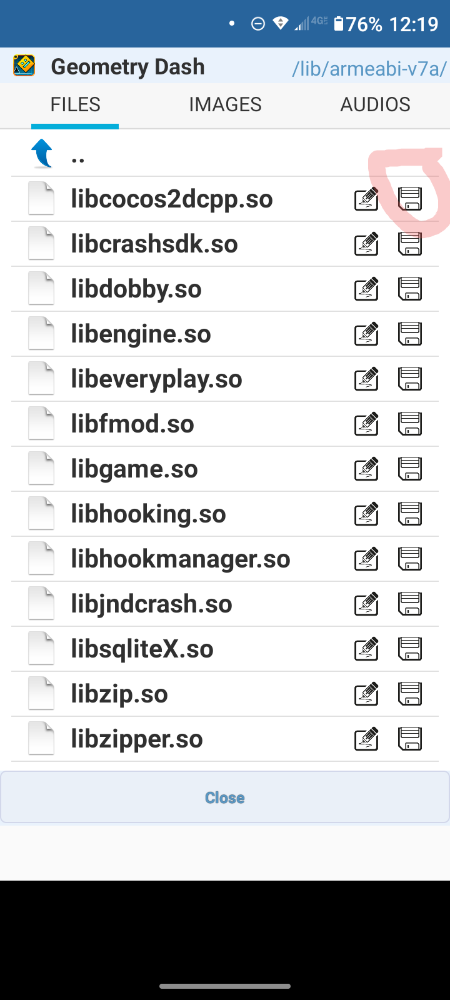

# Adding a Mod Menu to your GDPS
This guide will teach you how to add a Mod Menu to your GDPS on mobile and PC!

## Android 
To add a mod menu to your GDPS you must have the following. 
- A Hex Editor
- Italian Apk Downloader's Mod Menu [https://www.youtube.com/watch?v=YNF_wk7uMuA]
- APK Editor
- Base64 Decoder [https://www.base64encode.org/]

1. Open APK Editor
2. Click "Select an APK File"
3. Find the APK of the **Mod Menu**
4. Click "Simple Edit"
5. Click on "Lib"
7. Click on "armebi-v7a"

9. Save "libcocos2dcpp.so"

11. Open your Hex Editor

13. Find "libcocos2dcpp.so" and open it
14. Search for "www.boomlings.com/database" **Make sure your searching by a string and NOT a Hex Fragment**
15. Than tap "Find and Replace" and replace "www.boomlings.com/database" with your GDPS link (Findable on your GDPS panel
    For example, if your GDPS link is "epicgdps.ps.fhgdps.com" than you'll change "www.boomlings.com/database" to "epicgdps.ps.fhgdps.com"
16. Open the Base64 Decoder and type "http://www.boomlings.com/database" and press "encode"
17. Copy the result and search for it in your Hex Editor
18. Go back to the Base64 Decoder and type your GDPS link into the box and press "encode"
19. Copy the result and find and replace "aHR0cDovL3d3dy5ib29tbGluZ3MuY29tL2RhdGFiYXNl" with the GDPS's encoded link
20. Save the File
21. Open APK Editor
22. Click on the APK of the **Mod Menu**
23. Click "Simple Edit"
24. Click on "lib"
25. Click on "armebi-v7a"
26. Replace the "libcocos2dcpp.so" with the modified one you created
27. Click "Save"

Your Done! Your GDPS should now have the mod menu when you open it. optioanlly you can do the following to fix the apk's name

1. Open APK Editor
2. Find the Apk in the ApkEditor/tmp folder
3. Click "Common Edit"
4. Change the App icon/name or whatever you would like
5. Click "Save"

Install the APK and the name should be the same!

## PC
This part of the guide will teach you how to add GDMegaOverlay to your PC GDPS. You will need the following
- Your GDPS's Files
- GDMegaOverlay [https://github.com/maxnut/GDMegaOverlay]

1. Open your GDPS file (The files you got from the panel)
2. Download the "gdmo" folder from the GDMegaOverlay github
3. Copy all the files over to your GDPS's folder

Congradulations! You've installed a mod menu on your PC version of your GDPS!
