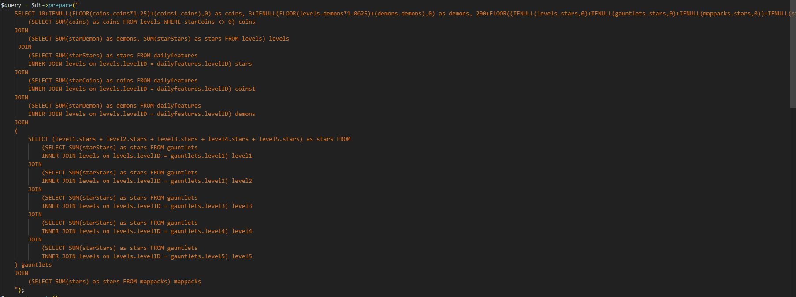
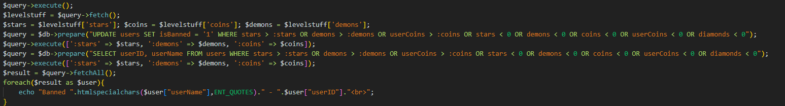
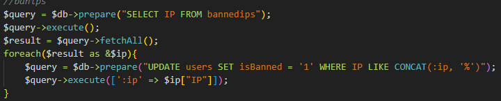
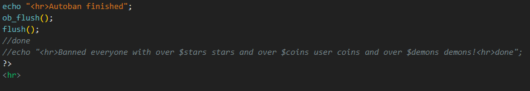

I have decided to make a guide on the autoban.php file which is included with Cron, since the code of it could be very complex for non-programmers

Lets look at the first bit of code:
# Connecting to the server
```php
include(../../incl/lib/connection.php)
```
At First, the code includes Connection.php which includes the server login information. this is a crucial part of the code since it cannot ban hackers/innocent players without being able to log in to the db.
# Calculating the stars
```php
$query = $db->prepare("too much code")
```

This is the most complex part of the code (and probably most unoptimized)
but all it really does is calculate all the stars in the gdps, all the user coins and all of the demons. It also calculates the gauntlets and map pack stars.
# Comparing users with calculated stars
```php
$query->execute();
```

Now, autoban.php is executing and making some variables for all the coins, stars and demons which are all part of the $levelstuff
next, the code is going to check if a user is banned and if they are going over the amount of stars calculated in the whole gdps (including map pack stars)
this is done for every user including moderators.
it next fetches all the results and compares them to the max stars, coins and demons.

# IP banning.

Now its gonna check if the user was already banned, if not they will set the user 'isBanned' state to 1 and ban their IP address (although doing that will do almost nothing unless they are using a static IP adderss).
and lastly, it echo's "Autoban Finished"

# Guide end
i hope this will help you understand how cron and autoban.php bans users. goodbye until i figure out anything else most likely related with cron.php. 