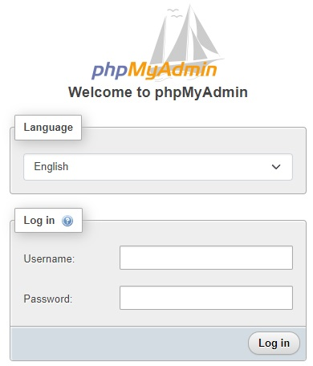

# How to Access PHPMyAdmin

GDPSFH has a site to access your GDPS database through **PHPMyAdmin**, here you can modify and find accounts, levels and any information coming from your GDPS.

## In order to access your database you first need your username and password.

1. You can find it in the [**GDPSFH panel**](https://panel.fhgdps.com/) in the [**GDPS Management section**](https://panel.fhgdps.com/gdps/management.php)
2. In the **"FTP & Database username"** section you can find your _username_
3. In the **"FTP & Database password"** section you can find your _password_
  ⚠ The password will be saved to your clipboard and then pasted into the password section of PHPMyAdmin (You should make sure the password has been copied with an alert in your bottom right corner of the page) 

4. In the **"GDPS Links"** section you can find the button [**"PHPMyAdmin"**](https://pma.fhgdps.com/phpMyAdmin/index.php) which will redirect you to a PHPMyAdmin login page to be able to enter the recently obtained username and password and access your database.
