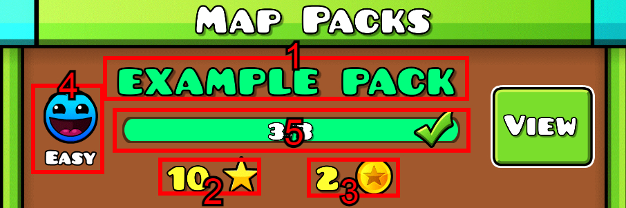

# Create Map Packs

## mappacks table structure

| Name       | Information                                                                         | Args                                                                                                                                                                                                                                                                                                                                                         |
| ---------- | ----------------------------------------------------------------------------------- | ------------------------------------------------------------------------------------------------------------------------------------------------------------------------------------------------------------------------------------------------------------------------------------------------------------------------------------------------------------ |
| ID         | Add a unique number to the map pack                                                 | (optional, auto-generated)                                                                                                                                                                                                                                                                                                                                   |
| name       | name of the map pack that will be displayed in the game **\[1]**                    | (not optional)                                                                                                                                                                                                                                                                                                                                               |
| levels     | Map pack level IDs separated by commas, example: `15908,981172,39223`               | You need **at least** 3 level IDs                                                                                                                                                                                                                                                                                                                            |
| stars      | Number of stars that the player will get when completing the map pack **\[2]**      | Minimum: 2 star, Maximum: 10 stars                                                                                                                                                                                                                                                                                                                           |
| coins      | Number of star coins that the player will get when completing the map pack **\[3]** | 
Either 1 or 2. No more, no less.
                                                                                                                                                                                                                                                                                                                   |
| difficulty | Map pack difficulty number that will be displayed in the game **\[4]**              | 
<strong>Difficulty number list:</strong> <code>0</code> = Auto, <code>1</code> = Easy, <code>2</code> = Normal, <code>3</code> = Normal, <code>4</code> = Harder, <code>5</code> = Insane, <code>6</code> = Hard Demon, <code>7</code> = Easy demon, <code>8</code> = Medium demon, <code>9</code> = Insane Demon, <code>10</code> = Extreme Demon
 |
| rgbcolors  | Name color of the map pack name that will be displayed in the game **\[1]**         | 
RGB Format (0-255) Example: `0,255,0` (0% Red, 100% Green, 0% Blue)
                                                                                                                                                                                                                                                                             |
| colors2    | Bar color of the map pack name that will be displayed in the game **\[5]**          | RGB Format like above                                                                                                                                                                                                                                                                                                                                        |

## Creating a map pack

Learn to access phpMyAdmin: 🔐 [Accessing to phpMyAdmin](site-structure.md)

Learn phpMyAdmin structure: 🔐 [Site Structure](site-structure.md)

1. Access to your phpMyAdmin database and Look for "mappacks".
2. Open the insert tab.
3. Fill out all fields correctly.
4. Click on "Go".
5. If nothing has gone wrong, you can restart the game to see the map pack being added to the game.

## Trivia

* Difficulty numbers 6 through 10 do not exist before GD 2.1 version.
