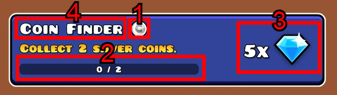

# Creating quests using PHPMyAdmin

## Quests table structure

| Name | Information | Args |
| ---- | ----------- | ---- |
| assignID | Add a unique number to the quest | (optional) |
| type | Number of the quest type that will be displayed in the game **[1]** | **types:**  `1` = Orbs, `2` = UserCoins, `3` = Stars (no optional) (number only) |
| amount |  Amount of orbs/stars/coins to complete the quest **[2]** | (no optional) (number only) |
| reward | Amount of diamonds that will be rewarded for completing the quest **[3]** | (no optional) (number only) |
| name | Name of the quest that will be displayed in the game **[4]** | (no optional) |

## Creating the quest 

Learn to access PHPMyAdmin: 🔐 [Accessing to phpMyAdmin](phpmyadmin/site-structure.md)

Learn PHPMyAdmin structure: 🔐 [Site Structure](phpmyadmin/site-structure.md)

⚠ It is recommended to add a minimum of 3 quests.

1. Access to your PHPMyAdmin database and Look for "quests".
2. Open the insert tab.
3. Fill out all fields correctly.
4. Click on "Go".
5. Your quest has been created! ✨

## Trivia

- Previously the quests were configured through the `config/questInfo.php` file along with the chests (currently the file was renamed to dailyChests.php)
- The first quests added by default to the Cvolton core had a name that was not at all appropriate and nothing pleasant for some peoples.