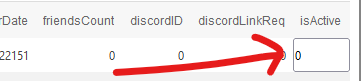

So, your GDPS kinda got messed up? Don't worry, I got the page for you! This will show you elegant, simple and swift fixes to even the most tedious-to-fix issues!

## Levels not appearing when you click search?
You might know this is because of the `starCoins` or `starDemon` value being 0 nor 1. But is there a simple way to fix the levels all at once instead of manually doing it for each and every level?
The answer might be indeed very shocking - it's yes! But how?
Well, it's a simple snippet of SQL code, of course!
```sql
-- Fix starCoins
UPDATE `levels` SET `levels`.`starCoins` = 1 WHERE `starCoins` > 1; 
UPDATE `levels` SET `levels`.`starCoins` = 0 WHERE `starCoins` < 0;

-- Fix starDemon
UPDATE `levels` SET `levels`.`starDemon` = 1 WHERE `starDemon` > 1;
UPDATE `levels` SET `levels`.`starDemon` = 0 WHERE `starDemon` < 0;
```

## Raided and want to remove the residue users?
If you know the exact user ID of the first residue user (for this example, it's 40) and the last residue users (for this example, it's 12345), you can remove the users simply and elegantly.
As always, I'm providing the snippet to this fix:
```sql
DELETE FROM `users` WHERE
    `users`.`userID` >= 40 -- first residue user ID
    AND `users`.`userID` <= 12345; -- last residue user ID
```

## Want to disable an account?
Set the `isActive` property on the account you want to disable (in `accounts` table) to 0! This should make the account nonfunctional while keeping it without removal of data and levels.
Now, this isn't some SQL-written fix (well technically it is because phpMyAdmin writes and executes the SQL code for you) but it is still simple, swift and elegant.



## Have any other questions?
Feel free to [submit an issue](https://github.com/MathieuAR-GDPSFH/community-guide/issues) or [create a thread in our Discord](https://discord.com/channels/1087797698771566644/1088950381209460818), we'll be glad to help!
