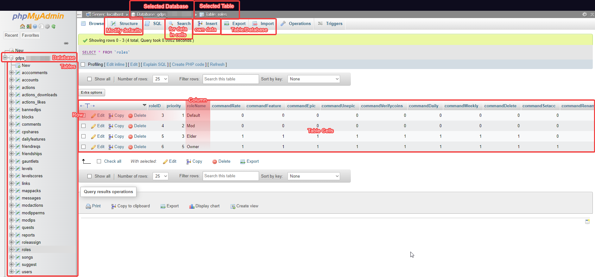

# Site Structure

 <- Click on the image to zoom in.

* Database - This is the root of where all the GDPS information is stored, such as accounts, levels, quests etc.
* Tables - Each individual table holds certain data. Imagine it like an excel table or a calendar that contains a couple columns as data and the ever-expanding rows as the data's content. The individual contents is what you can see in the middle of the screen when a table is selected.

In the top menu bar you can see a few buttons. Those will show different screens and let you interact with tables in various ways.

* Browser - This allows you to view and modify individual entries in a table. This can be helpful if you need to make changes outside of the GDPSFH web panel.
* Structure - You can manipulate each data column in a table. You can change how they are set and indexed, and you can add new columns for more customization. However, this can be confusing for beginners.
* SQL - Here you can run SQL scripts to manipulate a table or database as you like. It is useful for making changes to multiple entries, but be aware that wrong actions are often irreversible.
* Search - Search up specific content or a range of content in a table. Wildcards can be used to get more results, such as searching for levels with the level name "Level No. %" which will return all levels that start with "Level No."
* Insert - Here you can insert your own data to a table. Please note that some things, such as the ID (usually the first row) is intentionally made to be left empty as it's generated automatically.
* Export/Import - You can export a table (or the whole database) to get a backup as a .sql. This is convenient for quickly creating a database backup or moving to a different host. You can also import an .sql file, but it can be tricky if there are existing tables or entries.\
  <mark style="color:red;">**Please note:**</mark> <mark style="color:red;"></mark><mark style="color:red;">Exporting the</mark> <mark style="color:red;"></mark><mark style="color:red;">`levels`</mark> <mark style="color:red;"></mark><mark style="color:red;">table does</mark> <mark style="color:red;"></mark><mark style="color:red;">**not**</mark> <mark style="color:red;"></mark><mark style="color:red;">export the levels itself, just the metadata. The actual level data can be found on the server inside the</mark> <mark style="color:red;"></mark><mark style="color:red;">`/data/levels`</mark> <mark style="color:red;"></mark><mark style="color:red;">folder.</mark>
